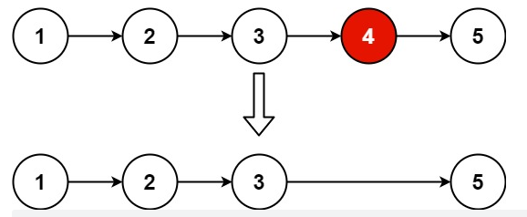

---
tags:
  - 算法
  - 链表
---

# 19. 删除链表的倒数第 N 个结点


题目地址:[19. 删除链表的倒数第 N 个结点 - 力扣（LeetCode） (leetcode-cn.com)](https://leetcode-cn.com/problems/remove-nth-node-from-end-of-list/)

## 题目

给你一个链表，删除链表的倒数第 `n` 个结点，并且返回链表的头结点。



**示例 1：**

```
输入：head = [1,2,3,4,5], n = 2
输出：[1,2,3,5]
```


## 解题思路

### 利用栈实现

将所有的节点数据都放进栈中之后，根据要删除的的节点位置，将节点由最后依次弹出找到弹出节点的前一个节点即可

### 代码实现

```java
package Leetcode;

import java.util.Deque;
import java.util.LinkedList;

public class Code19 {
    public class ListNode {
        int val;
        ListNode next;

        ListNode() {
        }

        ListNode(int val) {
            this.val = val;
        }

        ListNode(int val, ListNode next) {
            this.val = val;
            this.next = next;
        }
    }
    public ListNode removeNthFromEnd(ListNode head, int n) {
        //使用栈将数据放入栈中，之后遍历删除
        //设置头结点，避免头结点删除的特殊情况
        ListNode listNode = new ListNode(0, head);
        Deque<ListNode> stack = new LinkedList<>();
        ListNode cur=listNode;
        while (cur!=null){
            stack.push(cur);
            cur=cur.next;
        }
        for (int i=0;i<n;++i){
            stack.pop();
        }
        ListNode prev=stack.peek();
        prev.next=prev.next.next;
        return listNode.next;
    }
}
```

## 双指针实现

### 解题思路

使用两个指针，慢指针在后，快指针在前,**快指针比慢指针快n个节点**，当快指针在链表结尾的时候，慢指针正好在要删除的节点位置的前一个位置

### 代码实现

```java
public class Code19 {
    public class ListNode {
        int val;
        ListNode next;

        ListNode() {
        }

        ListNode(int val) {
            this.val = val;
        }

        ListNode(int val, ListNode next) {
            this.val = val;
            this.next = next;
        }
    }
    /**
     * 使用双指针实现
     * @param head
     * @param n
     * @return
     */
    public ListNode removeNthFromEnd2(ListNode head, int n) {
        //使用栈将数据放入栈中，之后遍历删除
        //设置头结点，避免头结点删除的特殊情况
        ListNode listNode = new ListNode(0, head);
        ListNode start=listNode;
        ListNode end=listNode;
        for (int i = 0; i < n; i++) {
            end=end.next;
        }
        while (end.next!=null){
            start=start.next;
            end=end.next;
        }
        start.next=start.next.next;
        //返回除开第一个增加的节点
        return listNode.next;
    }
}
```